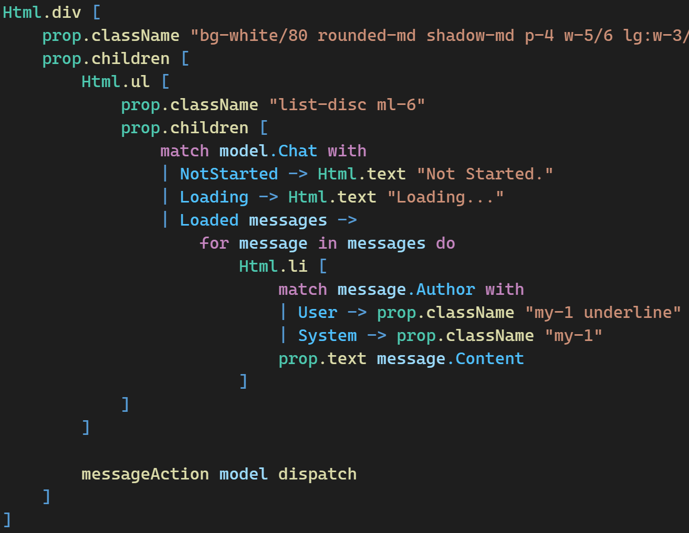
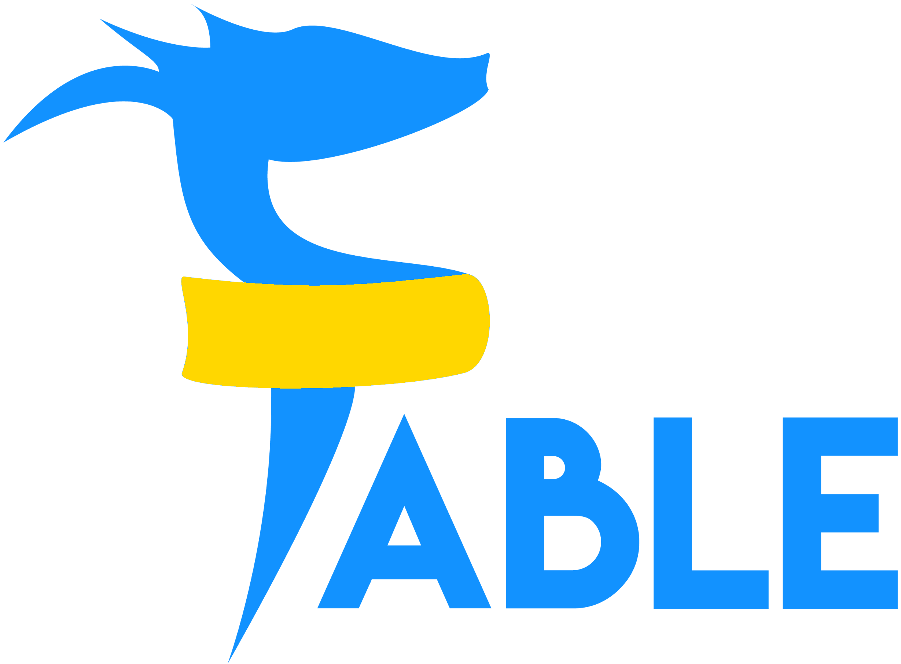
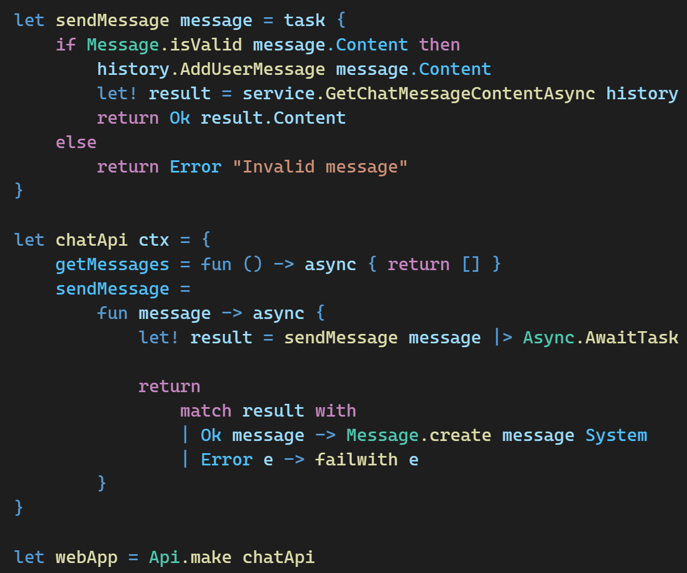

# 個人開発で使ってるやつを紹介する回

Sendai Frontend Meetup #13

---

## id:yohfee

株式会社はてな

Mackerel 開発チーム

アプリケーションエンジニア

---

## DEMO: OpenAI 使ってみましたってだけ

---

<!-- _class: invert lead -->

## フロントエンドとバックエンド
## 違う言語で書くのたいへん

---

<!-- _class: invert lead -->

## TypeScript でどっちも書けばいいじゃん

---

<!-- _class: invert lead -->

## だが断る

---

## 俺のフロントエンドを見てくれ
## こいつをどう思う？

---

<!-- _class: invert lead -->

## すごく…
## React??です??

---

<!-- _class: invert lead -->

https://fable.io/

---

<!-- _class: invert lead -->

## Fable is a compiler that brings
## F# into the JavaScript ecosystem

---

<!-- _class: invert lead -->

## F# を JavaScript にトランスパイルする君

---

<!-- _class: invert lead -->

## F#

---

## ちなみにバックエンドはこんな感じ

---

<!-- _class: invert lead -->

## F# でどっちも書けばいいじゃん

---

## F#er にしか通じない使えて嬉しいアレ

- パターンマッチ
- コンピュテーション式
- 測定単位
- 型プロバイダ
- etc...

---

## FAQ: 使い物になるのか

個人的には今のところはなってるし
そこそこ使い込んでそうな海外企業もそれなりにいそう

React などの主要なライブラリはバインディングがあって
F# の構文で違和感なく書ける

JavaScript との相互運用性もそんなに辛くないので
イザという時も対応可能

---

## コードを見ながら観光案内

フロントエンドとバックエンドで型や関数を共有できる

共有した型は Fable Remoting を使うと RPC になるので
OpenAPI や GraphQL よりもお手軽に
フロントエンドとバックエンドの通信ができる

Elmish という Elm を参考にした MVU パターンで
イミュータブルで関数型的なアーキテクチャがハマる

---

## FAQ: バンドルサイズは

お仕事じゃないので今のところは気にしてない

さすがにBlazorよりは小さそう

---

## 余談: 実はJS以外にもトランスパイルできる

- JavaScript (Stable)
- TypeScript (Stable)
- Dart (Beta)
- Python (Beta)
- Rust (Alpha)
- PHP (Experimental)

---

<!-- _class: invert lead -->

まとめ

## F# はいいぞおじさん「F# はいいぞ」

---

<!-- _class: invert lead -->

## 宣伝

---

